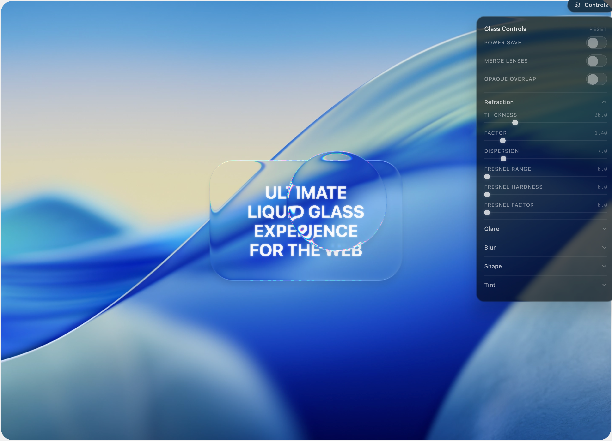

# aqualens

Ultimate Liquid Glass effect for the web.

**[Live demo](https://famence.github.io/aqualens/)**

[](https://famence.github.io/aqualens/)

Monorepo with:
- `@aqualens/core` — framework-agnostic WebGL2 engine
- `@aqualens/react` — React bindings and components

## Packages

- Core package README: `packages/core/README.md`
- React package README: `packages/react/README.md`

## Monorepo structure

```text
packages/
  core/    # @aqualens/core
  react/   # @aqualens/react
demo/      # Next.js showcase app
```

## Requirements

- Node.js 18+
- npm 9+

## Installation

```bash
npm install
```

## Quick start (development)

Build all workspaces:

```bash
npm run build
```

Typecheck all workspaces:

```bash
npm run typecheck
```

Run package dev builds in watch mode:

```bash
npm run dev
```

## Demo app

The hosted demo is at **[famence.github.io/aqualens](https://famence.github.io/aqualens/)**.  
The repository also includes the source in `demo/` (Next.js).  
To run it locally:

```bash
cd demo
npm install
npm run dev
```

## Package install examples

Install core:

```bash
npm install @aqualens/core
```

Install React bindings:

```bash
npm install @aqualens/react @aqualens/core
```

For API details and usage examples, see:
- `packages/core/README.md`
- `packages/react/README.md`

## License

MIT
