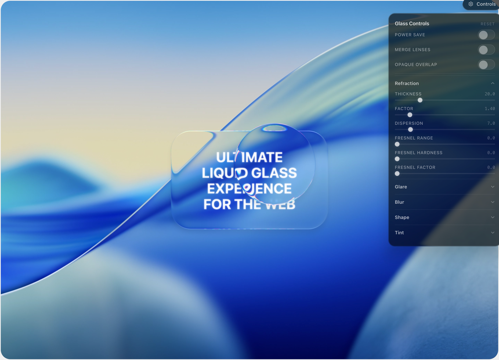
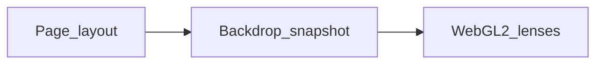

# Aqualens

Liquid glass UI for the web: refraction, glare, and soft blur sampled from the real pixels behind each pane—all rendered with **WebGL2**.

[**Live demo**](https://famence.github.io/aqualens/)

[](https://famence.github.io/aqualens/)

## What it is

Aqualens turns ordinary DOM elements into **glass panels**. The engine captures a **backdrop snapshot** (via the peer library [`html2canvas-pro`](https://www.npmjs.com/package/html2canvas-pro)), then draws each panel in WebGL using that image as the source. Your CSS still defines the shape and tint: **`border-radius`** for the outline and a **semi-transparent `background-color`** for the glass color.

## How it works


```mermaid
flowchart LR
  page[Page_layout]
  snap[Backdrop_snapshot]
  gl[WebGL2_lenses]
  page --> snap --> gl
```

1. You choose a **snapshot root** (usually a wrapper around the content that should appear “through” the glass).
2. The renderer captures that region when needed.
3. One **shared WebGL context** draws every glass element (**lens**) on the page for consistent performance and a single capture pipeline.

## When to use it

- Frosted or **liquid-glass** cards and toolbars over photos, video, or busy UIs
- **Hero** sections and landing blocks with a strong depth cue
- **Navigation** or **tab** chrome where the background should stay readable
- Any layout where the glass must **match the real content behind it**, not a fake static blur

## Packages

| Package | Use it for |
|--------|------------|
| [`@aqualens/core`](packages/core/README.md) | Vanilla JS or any framework; shared renderer, lens API, and types |
| [`@aqualens/react`](packages/react/README.md) | React 18+ apps; `<Aqualens>` component and hooks |

## Requirements

- A **WebGL2**-capable browser
- **[`html2canvas-pro`](https://www.npmjs.com/package/html2canvas-pro)** installed in your app (peer dependency of both packages)
- **React** `>= 18` if you use `@aqualens/react`

## Install

Core (framework-agnostic):

```bash
npm install @aqualens/core html2canvas-pro
```

React:

```bash
npm install @aqualens/react html2canvas-pro
```

## Quick start (React)

```tsx
"use client";

import { useState } from "react";
import { Aqualens } from "@aqualens/react";

export function HeroGlass() {
  const [backdrop, setBackdrop] = useState<HTMLDivElement | null>(null);

  return (
    <div ref={setBackdrop} className="relative min-h-64">
      

      {backdrop ? (
        <Aqualens
          snapshotTarget={backdrop}
          className="absolute left-1/2 top-1/2 w-72 -translate-x-1/2 -translate-y-1/2 rounded-3xl p-6 bg-white/20"
          refraction={{ thickness: 22, factor: 1.4 }}
          glare={{ factor: 35, range: 20 }}
          blurRadius={4}
        >
          <p>Content inside the glass</p>
        </Aqualens>
      ) : null}
    </div>
  );
}
```

Use a semi-transparent background on the glass host so the library can infer **tint**; `border-radius` defines the **shape**.

## Quick start (Core)

```ts
import {
  getSharedRenderer,
  updateSharedRendererConfig,
  DEFAULT_OPTIONS,
  type AqualensConfig,
} from "@aqualens/core";

const renderer = await getSharedRenderer(
  document.getElementById("backdrop"),
  2,
);

await updateSharedRendererConfig(
  document.getElementById("backdrop"),
  2,
);

const config: AqualensConfig = {
  ...DEFAULT_OPTIONS,
  resolution: 2,
  refraction: { ...DEFAULT_OPTIONS.refraction, thickness: 24 },
  glare: { ...DEFAULT_OPTIONS.glare, factor: 40 },
  blurRadius: 4,
  blurEdge: true,
  on: {
    init(lens) {
      /* lens ready */
    },
  },
};

const el = document.getElementById("glass")!;
renderer.addLens(el, config);

await renderer.captureSnapshot();
```

Call `captureSnapshot()` when the backdrop content or layout changes so the glass stays in sync.

## Learn more

Full API tables, hooks, reveal attributes, power-save mode, and advanced options:

- [`packages/core/README.md`](packages/core/README.md)
- [`packages/react/README.md`](packages/react/README.md)

## Demo

Open the hosted **[demo](https://famence.github.io/aqualens/)** or run the Next.js app in this repo:

```bash
cd demo
npm install
npm run dev
```

## Developing this repo

From the repository root (workspaces for `packages/core` and `packages/react`):

```bash
npm install
npm run build
npm run typecheck
```

## License

MIT — [repository](https://github.com/famence/aqualens)
